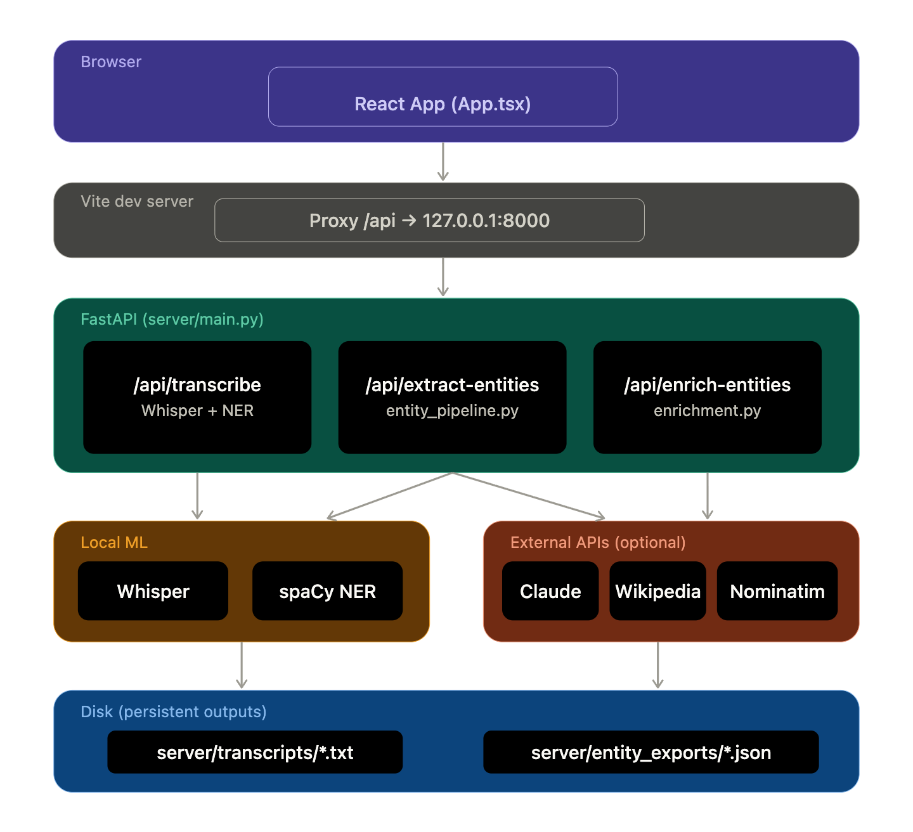

# PodLens

PodLens is an AI-powered context generator for podcasts. It listens to audio, transcribes it, and automatically enriches the content by identifying key references such as people, companies, locations, and technologies—and adding relevant images, maps, and summaries in real-time.

## Features

- **Audio Transcription:** Powered by OpenAI's Whisper for accurate, timestamped transcripts.

https://github.com/user-attachments/assets/4b8ee1bf-2946-4abc-87b3-8432aa8f52d6
  
- **Entity Extraction:** Automatically identifies entities like People, Companies, Locations, and Events using either spaCy or Anthropic's Claude.
- **Context Enrichment:**
  - **Wikipedia:** Pulls summaries and thumbnails for identified entities.
  - **OpenStreetMap (Nominatim):** Generates interactive map previews for mentioned locations.
  - **Unsplash:** Finds high-quality, relevant stock photos to visualize the discussion.

https://github.com/user-attachments/assets/d97e2ba6-fbba-426e-b249-aaa80cc6fb22

- **Interactive UI:** A modern React interface to view transcripts alongside their enriched context "cards".

## System Architecture



## Work Flow

1. **Audio Upload**: The user uploads an audio file (MP3, WAV, M4A, etc.) through the React-based frontend.
2. **FastAPI Processing**: The frontend sends the audio file to the `/api/transcribe` endpoint on the FastAPI backend.
3. **Whisper Transcription**: The backend uses OpenAI's Whisper model (running locally) to generate a full transcript with precise timestamps for each segment.
4. **Entity Extraction**:
   - The transcript text is cleaned of filler words (like "um", "uh", "you know").
   - PodLens identifies key entities: **People, Companies, Locations, Technologies, Events, and more**.
   - Extraction is performed by either **spaCy** (fast, local) or **Anthropic's Claude** (high-accuracy NER) based on configuration.
5. **Context Enrichment**:
   - For every extracted entity, PodLens queries external APIs in parallel:
     - **Wikipedia API**: Fetches a concise summary and a thumbnail image.
     - **Nominatim (OpenStreetMap)**: If it's a location, it retrieves coordinates and generates an interactive map embed URL.
     - **Unsplash API**: Searches for a high-quality relevant photograph to visualize the topic.
6. **Data Persistence**:
   - The final transcript is saved as a `.txt` file in the `server/transcripts/` directory.
   - The enriched entity data, including all metadata and API links, is exported as a `.json` file in `server/entity_exports/`.
7. **Interactive Display**: The React frontend receives the processed JSON and renders the transcript. Enriched "Context Cards" appear dynamically, allowing users to click and explore maps, images, and summaries related to what is being said.

## APIs & Technology Stack

### Frontend
- **React 19**
- **TypeScript**
- **Vite**
- **Tailwind CSS** 

### Backend
- **FastAPI** (Python)
- **OpenAI Whisper** (Local transcription)
- **spaCy** (Local NLP/NER)
- **Anthropic Claude API** (Optional, for high-accuracy NER)

### External Services
- **Wikipedia API:** For entity summaries.
- **Nominatim (OpenStreetMap):** For geocoding and map embeds.
- **Unsplash API:** For entity-related imagery.

---

## Installation

### Prerequisites
- **Node.js** (v18 or later recommended)
- **Python** (3.9 or later)
- **FFmpeg** (Required by Whisper for audio processing)

### 1. Clone the repository
```bash
git clone https://github.com/dhruvpathak1/PodLens_AI_Context_Generator/tree/main
cd PodLens_AI_Context_Generator
```

### 2. Frontend Setup
```bash
npm install
```

### 3. Backend Setup
```bash
cd server
python -m venv venv

# On macOS/Linux:
source venv/bin/activate

# On Windows:
# venv\Scripts\activate

pip install -r requirements.txt
cd ..
```

## Configuration

1. Copy the `.env.example` file to `.env`:
```bash
cp .env.example .env
```
3. Open `.env` and fill in your API keys:
   - `UNSPLASH_ACCESS_KEY`: Get one from [Unsplash Developers](https://unsplash.com/developers).
   - `ANTHROPIC_API_KEY`: (Optional) If you want to use Claude for entity extraction.
   - `NOMINATIM_USER_AGENT`: Set this to your app name or email

## Running the App

You can run both the frontend and the backend simultaneously from the root directory:

```bash
npm run dev
```

- **Frontend:** [http://localhost:5173](http://localhost:5173)
- **Backend API:** [http://127.0.0.1:8000](http://127.0.0.1:8000)

The first time you run a transcription, the Whisper model (default: `base`) will be downloaded automatically. This may take a few minutes depending on your internet connection.
